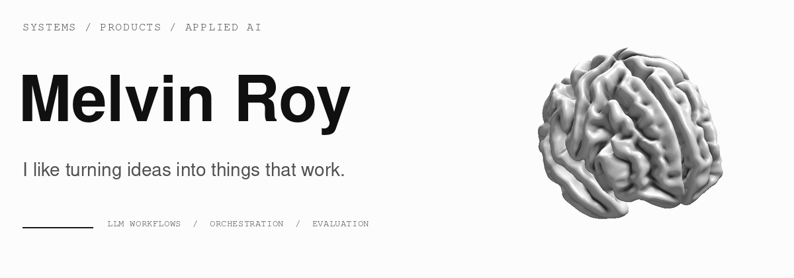

<picture>
  <source media="(max-width: 600px) and (prefers-reduced-motion: reduce)" srcset="./assets/profile-header-mobile.png" />
  <source media="(prefers-reduced-motion: reduce)" srcset="./assets/profile-header.png" />
  <source media="(max-width: 600px)" type="image/webp" srcset="./assets/profile-header-mobile.webp" />
  <source media="(max-width: 600px)" srcset="./assets/profile-header-mobile.gif" />
  <source type="image/webp" srcset="./assets/profile-header.webp" />
  
</picture>

### The whole system is what interests me.

My background is in **analytics and data systems**. What keeps me curious is building the whole thing: understanding a problem, connecting the pieces, and turning it into a product that makes someone's work easier.

These days, a lot of that curiosity goes into **LLM workflows and agentic systems**. I enjoy working through how models use tools, carry context between steps, and fit into a workflow people can actually rely on. The orchestration, the evaluation, the interface, and all the awkward cases in between are part of the appeal.

## What keeps me curious

- **Orchestration.** How should a workflow route a task, remember where it is, recover from a failed step, or hand a decision back to a person? I'm exploring that through LangGraph, tool use, durable state, and human approval flows.
- **Evaluation.** Did a change make the system better? I care about testing the full workflow, understanding failure cases, and using evidence to decide what to improve next.
- **Building the product.** The data underneath it, the logic connecting it, and the experience of using it. I like working across those boundaries and learning what each version gets wrong.

I also keep coming back to **open-source models, local agents, GPU inference, and robotics**. Different ways of exploring the same curiosity: how intelligence becomes something useful in the world.

## Things I am building

### [Outreach Intelligence](https://github.com/Melvinroy/Outreach)
An experiment in **human-governed agentic workflows** — durable state, LLM-assisted routing, approvals, event history and supervised execution working together as one system.

### [Brontide](https://github.com/Melvinroy/Journal)
A self-hosted **decision and feedback system** that brings discovery, risk logic, execution planning and learning into one workflow.

---

Most of this is work in progress. I build things I want to use, learn where they fall short, and keep improving them.

[LinkedIn](https://linkedin.com/in/melvinroy1) · [Email](mailto:melvinroy.victor@gmail.com)

[About the animation](./assets/CREDITS.md)
